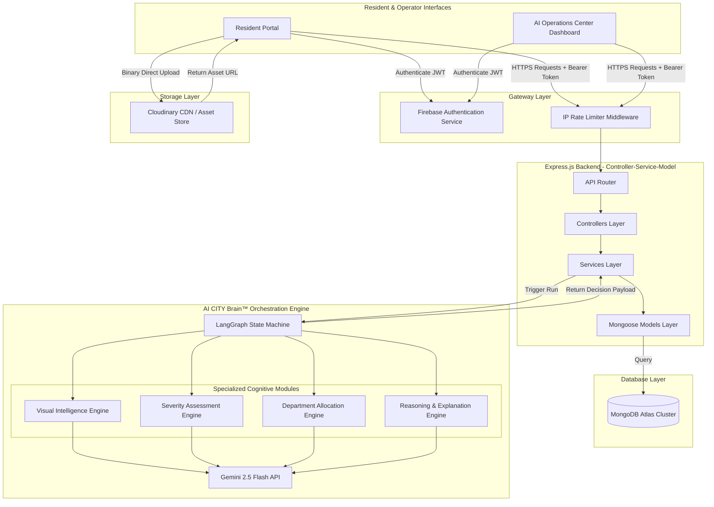

# Technical Architecture Specification: AI CITY

**AI CITY: An AI Operating System for Autonomous Civic Operations**  
*Document Version:* 1.1.0  
*Author:* Principal Software Architect  

---

## 1. Overall System Architecture & Storytelling Flow

AI CITY is designed around a decoupled, client-server model optimized for web scale, real-time data processing, and multi-agent cognitive reasoning. 

Rather than presenting a simple technical stack, the architecture is designed to tell a human-centric story: **Resident reports an incident → AI CITY Brain™ understands, reasons, and decides → City responds via the AI Operations Center**.

### 1.1. The Narrative Processing Pipeline
```
[ Resident Submits Incident ]
            │
            ▼
┌──────────────────────────────────────────────────────────────────┐
│                      AI CITY Brain™                              │
│                                                                  │
│  1. Ingest Raw Image & Description                               │
│  2. Visual Intelligence Engine extracts hazard vectors           │
│  3. Severity Assessment Engine calculates public safety risk      │
│  4. Department Allocation Engine maps municipal jurisdiction     │
│  5. Reasoning & Citizen Response Engines synthesize outputs      │
└────────────────────────────────┬─────────────────────────────────┘
                                 │
                                 ▼
[ AI Decision Report Card ] ──► [ AI Operations Center & Heatmap ]
```

### 1.2. High-Level Architecture Diagram


### 1.3. Architecture Decision Rationale: "Why Agentic AI?"
Judges and architects frequently challenge the use of heavy AI frameworks. AI CITY implements an **Agentic AI Pipeline (LangGraph + Gemini 2.5 Flash)** due to concrete technical challenges:

* **Inadequacy of Traditional Rule Engines:** 
  Regex or rule matrices fail to parse conversational human inputs. A report saying *"The road is collapsed and water is gushing out"* maps semantically to a critical pipe rupture threat, not a simple drainage cleanup. The AI CITY Brain™ understands context and semantic relationships.
* **Limitations of Traditional ML Models:** 
  Standard classification models (e.g., FastText or simple CNN classifiers) output static labels (e.g., "pothole"). They lack **contextual hazard awareness** (e.g., a pothole next to an school zone requires a critical escalation compared to one in an empty field).
* **Why LangGraph State Machines?** 
  Unlike simple linear chains, LangGraph allows for cycle loops and fallback states. If our confidence evaluator node calculates an allocation confidence score of $< 0.82$, it triggers a loop to check geographic contexts, or overrides the ticket to a human-triaged operational queue.

---

## 2. Frontend Architecture

The frontend is a single-page application built on React 19, TypeScript, and Vite. It is designed to act as a high-density, real-time command center.

### 2.1. Key UI Features & Components
* **AI Thinking Timeline:** An animated component (Framer Motion) that renders a progress checklist while the AI CITY Brain™ compiles the incident report:
  * `[✓] Ingesting Photo & Coordinates...`
  * `[✓] Visual Intelligence Engine processing...`
  * `[✓] Severity Assessment Engine resolving...`
* **AI Decision Report Card:** The signature resident-facing output. It includes a visual confidence meter (`██████████░░ 94%`), a bulleted breakdown of the **Why** behind the decisions, and estimated resolution parameters.
* **AI Operations Center:** The administrative portal displaying:
  * **City Health Score Panel:** Aggregated meters calculating live road, water grid, and electrical system health indexes.
  * **AI Heatmap:** Leaflet mapping layers colored by incident severity (Red = High Risk, Orange = Medium, Green = Resolved).

### 2.2. Folder Structure (Frontend)
```
c:/Antigravityyyyy/AI CITY/frontend/
├── public/
├── src/
│   ├── assets/               # Branding assets, maps
│   ├── components/           # Reusable UI elements
│   │   ├── ui/               # Shadcn components (Card, Button, Dialog)
│   │   ├── Map/              # Leaflet & AI Heatmap configurations
│   │   └── Layout/           # Shell templates, Sidebars
│   ├── config/               # Firebase, Axios custom clients
│   ├── features/             # Feature domains (Domain-Driven Design)
│   │   ├── auth/             # Session contexts, guards
│   │   ├── incidents/        # Ingestion form, Timeline, Report Cards
│   │   └── operations/       # Command Center, Heatmap, Health Scores
│   ├── hooks/                # Custom hooks (useMapInstance, useAuth)
│   ├── routes/               # Routing tree & guards
│   ├── services/             # HTTP Client layers
│   ├── store/                # UI state stores (Zustand)
│   ├── types/                # Component & API typings
│   ├── utils/                # Formatting utilities
│   ├── App.tsx
│   ├── index.css
│   └── main.tsx
```

---

## 3. Backend Architecture: Simplified MVP Data Flow

To optimize development speed during the 36-hour hackathon, we bypass unnecessary enterprise layers (like the Repository Pattern) in favor of a clean, decoupled **Controller → Service → Model** architecture. 

```
[ Express Request ]
        │
        ▼
[ Controllers ] (Parses route payload, checks schema validation)
        │
        ▼
[ Services ] (Implements workflows, calculates duplicate rules, runs AI Brain)
        │
        ▼
[ Mongoose Models ] (Direct schema queries to MongoDB)
```
* **Rationale for Simplification:** Removing the Repository boilerplate allows us to build and iterate rapidly. The separation of business workflows inside the Service layer ensures that we can easily re-introduce the Repository pattern in V2 without touching API routing or AI code.

### 3.1. Folder Structure (Backend)
```
c:/Antigravityyyyy/AI CITY/backend/
├── src/
│   ├── config/               # Firebase Admin, Cloudinary, DB credentials
│   ├── controllers/          # HTTP parsing and routing controllers
│   ├── middleware/           # Rate-limiting, JWT auth, error handlers
│   ├── models/               # Mongoose DB schema definitions
│   ├── services/             # Workflows, Duplicate check, AI Brain execution
│   ├── utils/                # Loggers, Validation schemas (Zod)
│   └── app.ts
├── test/                     # Vitest test files
├── package.json
└── tsconfig.json
```

---

## 4. Database Architecture

The database is powered by MongoDB Atlas. The schemas are index-optimized to support geospatial searches and smart duplicate detection.

### 4.1. Collections & Schema Definitions

#### Users Collection
Stores identities synced from Firebase:
```typescript
{
  _id: ObjectId,
  firebaseUid: { type: String, unique: true, index: true },
  email: String,
  role: { type: String, enum: ['citizen', 'admin'], default: 'citizen' },
  createdAt: Date
}
```

#### Incidents Collection
Maintains raw citizen submissions and current states:
```typescript
{
  _id: ObjectId,
  citizenId: { type: ObjectId, ref: 'User', index: true },
  title: String,
  description: String,
  imageUrl: String,
  location: {
    type: { type: String, enum: ['Point'], required: true },
    coordinates: { type: [Number], required: true } // [longitude, latitude]
  },
  category: String,
  severity: { type: String, enum: ['Low', 'Medium', 'High', 'Critical'], index: true },
  department: { type: String, enum: ['PWD', 'ELECTRICITY', 'WATER_BOARD', 'SANITATION'], index: true },
  status: { type: String, enum: ['Submitted', 'AI_Assigned', 'In_Progress', 'Resolved'], default: 'Submitted', index: true },
  isDuplicate: { type: Boolean, default: false },
  parentIncidentId: { type: ObjectId, ref: 'Incident', nullable: true },
  witnessCount: { type: Number, default: 1 },
  createdAt: Date
}
```

#### AI Decision Logs Collection
Stores the complete audit trail of the AI CITY Brain™ operations:
```typescript
{
  _id: ObjectId,
  incidentId: { type: ObjectId, ref: 'Incident', index: true },
  promptTokens: Number,
  completionTokens: Number,
  latencyMs: Number,
  modelName: String,
  imageFeatures: [String],
  confidenceScore: Number,
  reasoningReport: String, // Full Markdown explainability report
  nodePath: [String],      // Path taken through LangGraph nodes
  executedAt: Date
}
```

#### Admin Overrides Collection
Logs manual corrections made by human operators:
```typescript
{
  _id: ObjectId,
  incidentId: { type: ObjectId, ref: 'Incident' },
  adminId: { type: ObjectId, ref: 'User' },
  originalField: { type: String, enum: ['severity', 'department'] },
  previousValue: String,
  newValue: String,
  overrideReason: String,
  createdAt: Date
}
```

### 4.2. Database Indexing Strategy
* **Geospatial Index:** A `2dsphere` index is configured on `location` to support instant proximity queries.
* **Proximity Indexing Code (Mongoose):**
  `IncidentsSchema.index({ location: '2dsphere' });`
* **Compound Indexing:** `{ department: 1, status: 1 }` and `{ status: 1, severity: -1 }` are set to optimize Operations Center dashboard queries.

---

## 5. AI Architecture: AI CITY Brain™ Orchestrator

The core intelligence is modeled as a unified **AI CITY Brain™** built using a state graph via **LangGraph**. The state machine evaluates inputs, classifies severity, maps allocations, and outputs the structured report.

```
                  [ Raw Incident Input ]
                            │
                            ▼
              ┌───────────────────────────┐
              │ Visual Intelligence Node  │
              └─────────────┬─────────────┘
                            │
                            ▼
              ┌───────────────────────────┐
              │ Severity Assessment Node  │
              └─────────────┬─────────────┘
                            │
                            ▼
              ┌───────────────────────────┐
              │ Department Allocation Node│
              └─────────────┬─────────────┘
                            │
                            ▼
              ┌───────────────────────────┐
              │  Confidence Evaluator     │
              └─────────────┬─────────────┘
                            │
            ┌───────────────┴───────────────┐
            ▼ (Conf >= 0.82)                ▼ (Conf < 0.82)
┌───────────────────────┐       ┌───────────────────────┐
│ Reasoning Synthesizer │       │ Manual Triage Node    │
└───────────┬───────────┘       └───────────┬───────────┘
            │                               │
            └───────────────┬───────────────┘
                            │
                            ▼
                [ Save Payload to DB ]
```

### 5.1. Module & Engine Specifications

1. **Visual Intelligence Engine:**
   * **Input:** Raw Image URL + description.
   * **Prompt Context:** *"You are the Visual Intelligence Module of AI CITY. Analyze the image to identify physical damage indicators (leaks, cracks, visual sparks, volume of debris) and list these visual tokens in the payload."*
   * **Output:** JSON list of extracted visual features.
2. **Severity Assessment Engine:**
   * **Input:** Visual features + resident notes.
   * **Calculation Logic:** Checks visual risk parameters against surrounding hazard criteria (e.g., proximity to high-density zones). Calculates an objective severity rating.
   * **Output:** Severity (`Low`, `Medium`, `High`, `Critical`).
3. **Department Allocation Engine:**
   * **Input:** Classified features.
   * **Logic:** Maps hazards to target municipal dispatches (PWD, Electricity, Water Board, Sanitation).
   * **Output:** Assigned department + allocation confidence score (0.00 to 1.00).
4. **Reasoning & Explanation Engine:**
   * **Input:** Decisions from previous engines.
   * **Prompt Context:** *"You are the Explainable AI (XAI) engine. Generate bulleted, logical justifications answering WHY this incident was assigned its severity and routed to this department. Highlight public safety risks."*
   * **Output:** Markdown-formatted bulleted explanation log.

### 5.2. Confidence Thresholding & Fallback Flow
* **Threshold Rules:** If the Department Allocation Engine confidence is $< 0.82$:
  * Route the state directly to the `Manual Triage Node`.
  * Set the database field `requires_manual_verification: true`.
  * Route the ticket to the Public Works general holding queue to await human inspection.
* **API Failure Handling:** In case of API rate limits or model timeout failures, the pipeline retries up to 3 times using exponential backoff. On persistent failures, it defaults to a safe state: Severity `Medium`, Department `PWD`, and sets `processing_fallback: true`.

---

## 6. API Architecture

All endpoints accept and return JSON payloads and enforce Firebase JWT verification on protected paths.

### 6.1. Endpoint Specifications

#### `POST /api/incidents`
Submits a new incident and triggers the AI CITY Brain™ pipeline.
* **Auth Requirement:** Bearer Token (Firebase User JWT).
* **Validation (Zod):**
  ```typescript
  {
    title: z.string().min(5).max(100),
    description: z.string().min(10),
    imageUrl: z.string().url(),
    location: z.object({
      lng: z.number(),
      lat: z.number()
    })
  }
  ```
* **Proximity Check (Duplicate Logic):**
  Before invoking the AI Brain, the service queries:
  ```javascript
  const duplicate = await Incident.findOne({
    category: detectedCategory,
    location: {
      $near: {
        $geometry: { type: "Point", coordinates: [lng, lat] },
        $maxDistance: 50 // 50 meters
      }
    },
    createdAt: { $gte: new Date(Date.now() - 48 * 60 * 60 * 1000) }, // 48 hours
    isDuplicate: false
  });
  ```
* **Success Response (`201 Created` - Standard Submit):**
  ```json
  {
    "success": true,
    "duplicateFound": false,
    "data": {
      "incidentId": "65f57c6b9e28f114c029a1b4",
      "status": "AI_Assigned",
      "aiReport": {
        "severity": "High",
        "confidence": 0.94,
        "department": "Water Supply & Sewerage Board",
        "why": ["Subterranean water leak under asphalt", "Creates road traction hazard", "Potential structural wash-out under road"],
        "estimatedResolution": "24 Hours"
      }
    }
  }
  ```
* **Success Response (`200 OK` - Duplicate Identified):**
  ```json
  {
    "success": true,
    "duplicateFound": true,
    "parentIncidentId": "65f57a0a9e28f114c029a0a1",
    "message": "Incident already reported 18 meters away. We have linked your report to Ticket #104."
  }
  ```

#### `PATCH /api/incidents/:id/override`
Allows operators to correct AI classifications.
* **Auth Requirement:** Bearer Token (Firebase Admin JWT).
* **Validation (Zod):**
  ```typescript
  {
    severity: z.enum(['Low', 'Medium', 'High', 'Critical']).optional(),
    department: z.enum(['PWD', 'ELECTRICITY', 'WATER_BOARD', 'SANITATION']).optional(),
    reason: z.string().min(15)
  }
  ```
* **Success Response (`200 OK`):**
  ```json
  {
    "success": true,
    "message": "AI allocation updated. Log stored in Admin Overrides."
  }
  ```

---

## 7. Security Architecture
* **Identity Mapping Middleware:** The backend uses the Firebase Admin SDK to decode JWTs:
  ```typescript
  const decodedToken = await admin.auth().verifyIdToken(idToken);
  req.user = { uid: decodedToken.uid, role: decodedToken.role || 'citizen' };
  ```
* **Role-Based Access Control (RBAC):** Routes labeled admin-only check the parsed user object:
  ```typescript
  if (req.user.role !== 'admin') return res.status(403).json({ error: 'Access Denied' });
  ```
* **Application Hardening:**
  * `Helmet` configuration secures HTTP response headers.
  * Inputs are passed to Mongoose parameterized query builders to prevent NoSQL injection.
  * Express rate-limit middleware restricts incident submissions to 5 calls per 10 minutes per IP.

---

## 8. Deployment & CI/CD Pipeline
* **Vercel:** Hosts the Vite-React frontend static files.
* **Render:** Runs the Dockerized Express.js server instance.
* **Atlas:** Stores all MongoDB schemas and spatial indexes.
* **CI/CD Pipeline Workflow:**
  ```
  [Git Commit] ──► [GitHub Actions Checks] ──► [Automated Build] ──► [Live Release]
  ```
  GitHub Actions run linting checks (`eslint`), type verification (`tsc --noEmit`), and integration tests (`vitest`) before executing live deployment hooks.

---

## 9. Scalability Plan: The Open-Closed Architecture

AI CITY is designed to expand into a complete smart city management framework. Future modules (Traffic AI, Waste AI, Water IoT) can be integrated without modifying the core codebase using two architectural patterns:

### 9.1. Event-Driven Broker Integration
The core Express application operates an event pipeline. When an incident is saved, the service publishes an event to a central broker (e.g. Node EventEmitters or Redis Pub/Sub):
```json
{
  "event": "incident.finalized",
  "data": {
    "id": "65f57c6b9e28f114c029a1b4",
    "category": "WaterBurst",
    "location": { "lat": 12.9716, "lng": 77.5946 },
    "severity": "High"
  }
}
```
Future modules run as microservices that subscribe to these event streams:
* **Water AI Module:** Subscribes to `"incident.finalized"`, filters for `category === 'WaterBurst'`, and automatically adjusts surrounding pressure valves in the municipal grid.
* **Traffic AI Module:** Listens for road hazards and adjusts surrounding traffic light intervals to prevent localized congestion.

### 9.2. Pluggable LangGraph Node Registry
The AI CITY Brain™ orchestrator includes a module registry. Developers can write custom LangGraph node routines and register them in a centralized configuration. When the system detects specific incident categories, it dynamically forwards the state path to the registered module, bypasses standard routing, and executes the specialized smart-city logic.
