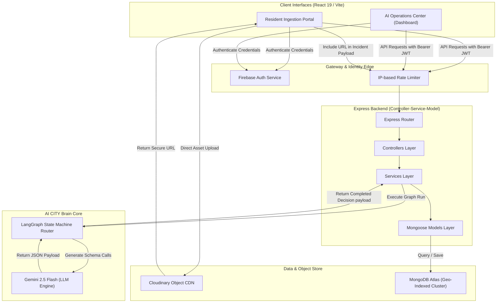
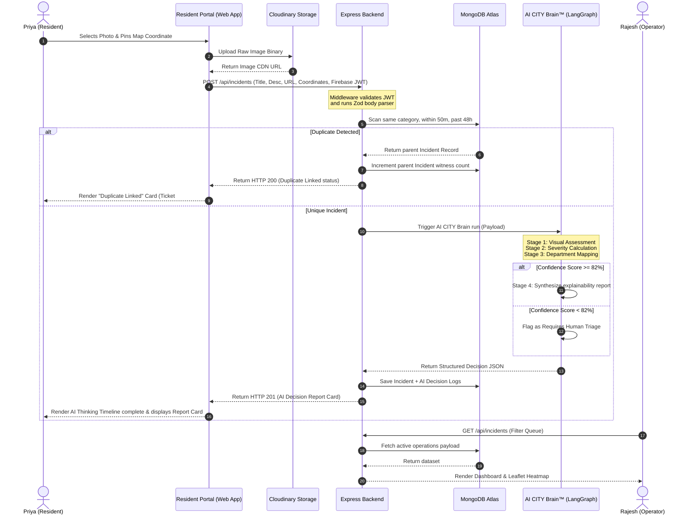
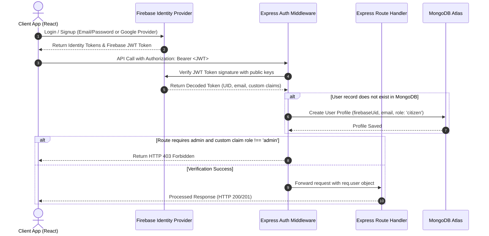
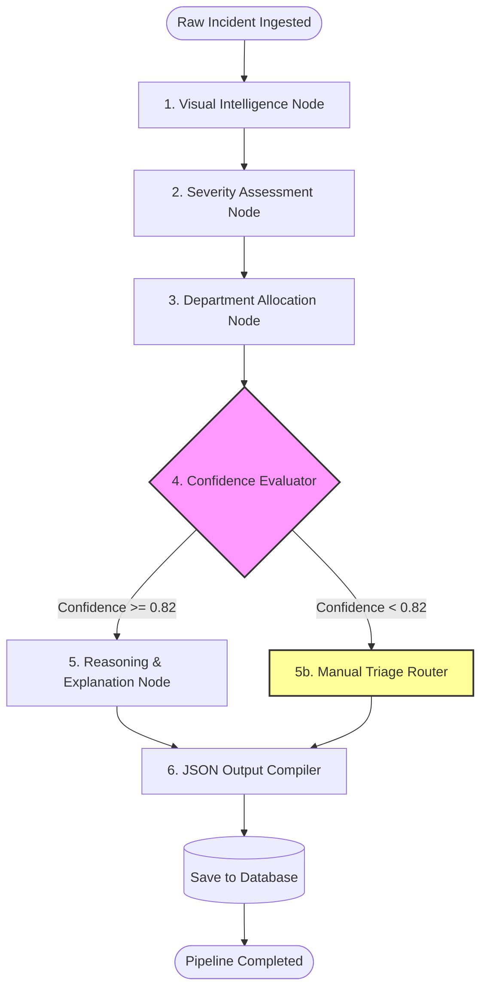
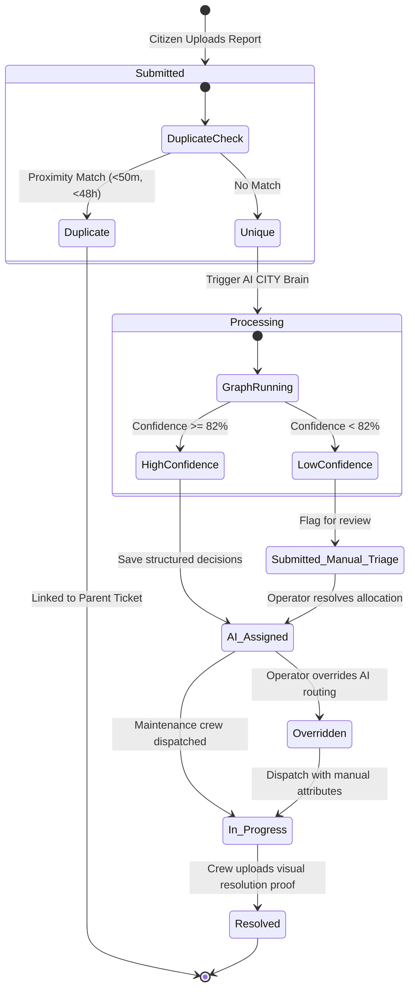
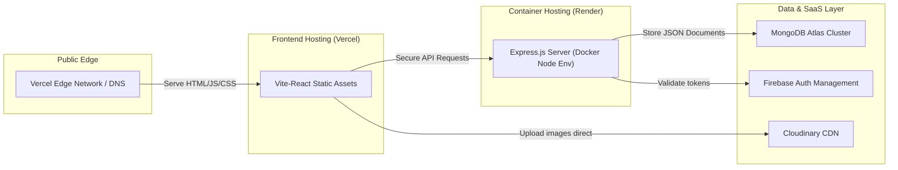

# System Architecture Specification: AI CITY

**AI Operating System for Autonomous Civic Operations**  
*Document Version:* v1.0  
*Status:* Approved Engineering Blueprint  

---

## 1. Executive Summary & Design Philosophy
Traditional civic administration tools are built as static CRUD wrappers around a relational database. Residents file complaints, municipal workers manually review them, and dispatchers manually schedule repairs. This model fails in modern cities: it suffers from high operational latency, resource routing inefficiencies, and administrative bottlenecks.

**AI CITY** is designed from the ground up not as a complaint portal, but as an **Agentic AI Operating System** that automates the entire lifecycle of civic incidents. The architecture prioritizes a 36-hour hackathon implementation context (high developer velocity, minimal boilerplate) without compromising post-hackathon scaling. We achieve this by establishing strict logical boundaries using a decoupled, event-ready **Controller-Service-Model** pattern, bypassing unnecessary enterprise layers (like the Repository Pattern) until Version 2.

---

## 2. High-Level Architecture
AI CITY is organized into four core layers:
1. **Presentation Layer:** Client-side React 19 Single Page Application (SPA) optimized for low latency and high-density telemetry.
2. **Gateway & Security Layer:** Firebase Authentication acts as the edge identity provider, while Express-level middlewares enforce rate-limiting, request validation, and Role-Based Access Control (RBAC).
3. **Application Service Layer:** A Node.js Express service built with TypeScript. It coordinates incident flows, triggers duplicate checking, and orchestrates the AI graph.
4. **AI & Storage Layer:** Cloudinary handles direct, performant visual asset storage. The **AI CITY Brain™** (modeled via a LangGraph state machine powered by Gemini 2.5 Flash) executes multi-stage reasoning to triage incidents.

---

## 3. System Component Diagram
The diagram below illustrates the topology of AI CITY v1.0 and how the client, gateway, backend, and external services interact.



---

## 4. End-to-End Data Flow Diagram
This flowchart describes the sequential data path from a resident submitting a physical hazard through to operational triage and final resolution tracking.



---

## 5. Authentication Flow
AI CITY delegates session credentials and validation to Firebase Authentication. The sequence diagram below shows how the backend authorizes API calls.



---

## 6. AI CITY Brain™ State Machine Workflow
The orchestrator operates as a unified cognitive model. If the routing logic cannot allocate an incident with high certainty, it executes an automated loop redirecting the ticket to a human queue.



---

## 7. Incident Lifecycle
Incidents move through well-defined lifecycle states, supporting both automated transitions and human operator overrides.



---

## 8. Deployment Topology Diagram
AI CITY v1.0 uses a modern serverless and managed container architecture to support quick deployment and elastic scaling.



---

## 9. Error Handling & Fail-Safe Architecture
To guarantee 100% uptime during the hackathon demo, AI CITY implements a cascading fail-safe protocol at every integration boundary.

| Integration Boundary | Failure Scenario | Detection Mechanism | Immediate Fail-Safe Behavior |
| :--- | :--- | :--- | :--- |
| **Cloudinary Ingestion** | Upload fails due to timeout or file size. | Express error interceptor catch. | Intercept request. Advise UI to run client-side canvas compression and retry once. If fail persists, allow submission with a default "image-missing" placeholder. |
| **Gemini 2.5 API** | Rate-limit reached (HTTP 429) or model timeout. | Axios interceptor detecting status codes or timeouts (>3000ms). | Execute 3 retries using exponential backoff. If it still fails, fall back to hardcoded defaults: Severity = `Medium`, Department = `PWD` (General maintenance), and set `processing_fallback: true`. |
| **MongoDB Connection** | Database cluster drops or times out. | Mongoose `connection.on('error')` listener. | Backend switches to memory-cache queue (simple array cache) and periodically retries DB connection. Returns a success indicator to the client to prevent resident lockout. |
| **Firebase SDK** | Auth server unreachable during API validation. | Firebase Admin SDK throws error. | Fall back to checking a local emergency fallback bypass key in development mode, or return HTTP 503 Service Unavailable. |

---

## 10. Future Extensibility: The Open-Closed Architecture
AI CITY is built to scale into a multi-domain Smart City Operating System without requiring structural changes to the core codebase. We provide two primary extension vectors:

### 10.1. Event-Driven Broker Integration
The core Express application operates an event pipeline. When an incident is saved, the service publishes an event to a central broker (e.g. Node EventEmitters or Redis Pub/Sub):
```json
{
  "event": "incident.finalized",
  "data": {
    "id": "65f57c6b9e28f114c029a1b4",
    "category": "WaterBurst",
    "location": { "lat": 12.9716, "lng": 77.5946 },
    "severity": "High"
  }
}
```
Future modules run as microservices that subscribe to these event streams:
* **Water AI Module:** Subscribes to `"incident.finalized"`, filters for `category === 'WaterBurst'`, and automatically adjusts surrounding pressure valves in the municipal grid.
* **Traffic AI Module:** Listens for road hazards and adjusts surrounding traffic light intervals to prevent localized congestion.

### 10.2. Pluggable LangGraph Node Registry
The AI CITY Brain™ orchestrator includes a module registry. Developers can write custom LangGraph node routines and register them in a centralized configuration. When the system detects specific incident categories, it dynamically forwards the state path to the registered module, bypasses standard routing, and executes the specialized smart-city logic.

---

## 11. Architectural Decisions & Tradeoffs

### Decision 1: Node.js/Express over Go or Python for Backend
* **Rationale:** Maximizes developer velocity during a 36-hour hackathon. The team can write unified TypeScript across the frontend and backend, enabling shared interface types.
* **Tradeoffs:** Node has lower CPU-bound throughput compared to Go. However, the system's performance bottlenecks will be network latency to Gemini and MongoDB, making Node's asynchronous I/O ideal.

### Decision 2: MongoDB over PostgreSQL
* **Rationale:** Incident schemas change rapidly when tuning LLM features. A document database allows schema adjustments without migration locks. Additionally, MongoDB has built-in, production-ready spatial indexing (`2dsphere`) out of the box, facilitating instant duplicate calculations.
* **Tradeoffs:** Bypassing PostgreSQL means losing complex ACID relational joins. For a hackathon MVP, the speed gains of schema-less documents outweigh the benefits of strict relational sanity.

### Decision 3: Direct Client-to-Cloudinary Uploads
* **Rationale:** Uploading images directly from the client to Cloudinary prevents the Express server from bottlenecking on file streaming, minimizing CPU and memory consumption on the free-tier Render instance.
* **Tradeoffs:** Requires client-side configuration of Cloudinary upload presets. However, this is easily secured via unsigned presets configured to accept only image formats under 5MB.
