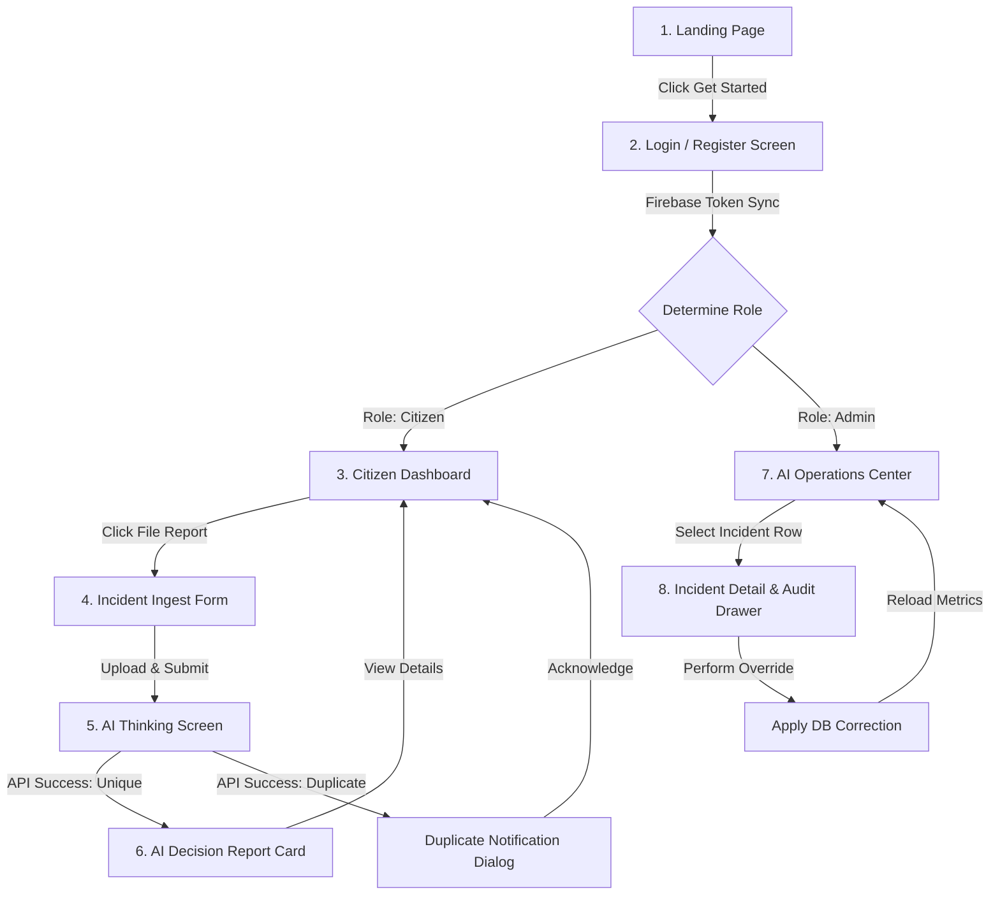

# UX Blueprint: AI CITY Screen-by-Screen Specifications

**Apple-Grade Visual Design & Interactive Storyboards**  
*Document Version:* v1.0  
*Status:* Approved UX Architecture  

---

## 1. Unified User Flow Diagram
The flowchart below maps the application states, routes, and logical pathways across both Citizen and Operator roles.



---

## 2. Screen-by-Screen Specifications

### Screen 1: Landing Page
* **Purpose:** Introduce the smart city operating system concept and hook the judges. It shifts focus from a simple complaint database to a real-time autonomous civic decision engine.
* **Layout Structure:**
  * Clean, dark grid layout featuring a centered value proposition header.
  * Inline glowing CTA button ("Enter the City Grid").
  * High-fidelity mockup graphic demonstrating an active incident telemetry node.
* **User Actions:**
  * Click "Enter the City Grid" button (navigates to `/login`).
* **Active API Calls:** None (static landing page).
* **AI Interactions:** None.
* **Loading State:** Instant static rendering.
* **Error State:** N/A.
* **Success State (Transition):** Standard route change to `/login` with a smooth 300ms page slide-out.
* **Apple-Like Design Details:**
  * **Interactive Grid Background:** A dark canvas background overlayed with a subtle radial grid pattern that follows mouse movements.
  * **Gradient Accent:** The header text features a color transition moving from Indigo to Violet.

---

### Screen 2: Login / Authentication Screen
* **Purpose:** Allow residents and operators to authenticate securely via Firebase.
* **Layout Structure:**
  * Centered glassmorphism sign-in card.
  * Tab selector switching between "Resident Sign In" and "Operator Portal".
  * Standard email/password forms alongside a single-click Google OAuth button.
* **User Actions:**
  * Toggle tab selection (sets local Zustand auth role target).
  * Input text fields (email, password).
  * Click "Sign In" button or "Continue with Google" button.
* **Active API Calls:**
  * Firebase SDK authentication handshake.
  * `POST /api/auth/sync` (triggered on auth state change to sync profile into MongoDB).
* **AI Interactions:** None.
* **Loading State:** The button displays a spinning loading indicator, and the input fields are locked in a disabled state during authentication.
* **Error State:** Displays a red outline on input fields, accompanied by clear error text (e.g. "Password incorrect").
* **Success State:** Redirects to `/citizen/dashboard` or `/ops` depending on the role.
* **Apple-Like Design Details:**
  * **Focus Ring Transition:** The input borders transition from dark zinc (`#27272a`) to Indigo (`#6366f1`) using a 200ms ease-in-out border color change.
  * **Shake Animation:** The login card shakes horizontally if the authentication credentials fail.

---

### Screen 3: Citizen Dashboard
* **Purpose:** Serve as the home command page for residents. Displays their submitted incidents and tracking statuses.
* **Layout Structure:**
  * Top header bar displaying quick emergency contacts.
  * Main view divided into a two-column grid:
    * Left column: A list of active, reported incidents.
    * Right column: Leaflet map showing pins of the user's submissions.
* **User Actions:**
  * Click "Report Incident" CTA button.
  * Select an incident card (highlights marker on map).
* **Active API Calls:**
  * `GET /api/incidents` (filtered by citizen owner ID).
* **AI Interactions:** None.
* **Loading State:** Pulsing skeleton loaders populate the incident cards, and the Leaflet container displays a grey loading tile overlay.
* **Error State:** Shows a warning card: "Failed to reload city database. [Retry]".
* **Success State:** Renders the incident list and coordinates.
* **Apple-Like Design Details:**
  * **Status Glow Indicators:** Each incident card features a glowing colored dot representing status (Blue: Submitted, Yellow: Undergoing AI assessment, Green: Resolved).
  * **Dynamic Hover Scale:** Cards lift slightly (`scaleY: 1.01`) and display an inset border shadow when hovered.

---

### Screen 4: Incident Submission Form
* **Purpose:** Capture incident data (photos, descriptions, exact geospatial location pins) from residents.
* **Layout Structure:**
  * Progress header: "Step 1 of 2: Details & Location".
  * Left column: Interactive drag-and-drop file upload box.
  * Right column: Integrated Leaflet map wrapper with pin-drop instructions.
* **User Actions:**
  * Drag/drop or select an image file.
  * Input description text in the text area.
  * Click map coordinate to drop location pin.
  * Click "Analyze Incident" CTA button.
* **Active API Calls:**
  * Direct file stream upload to Cloudinary.
  * `POST /api/incidents` (payload transfer on form submission).
* **AI Interactions:** None (pre-submission phase).
* **Loading State:** File upload displays an active linear progress bar inside the dropzone container.
* **Error State:** Renders red outline boundaries on missing inputs, with toast warnings (e.g., "Please drop a pin on the map to define coordinates").
* **Success State:** Redirects to the AI Thinking screen on successful submission.
* **Apple-Like Design Details:**
  * **Map Pin Pulse:** The Leaflet geopin marker displays a glowing radial pulse animation (`ping-animation`) when dropped on the map.
  * **Glassmorphic Dropzone:** The upload container transitions to an emerald border with a green fill when a valid file is hovered over it.

---

### Screen 5: AI Thinking Timeline Screen
* **Purpose:** Render a step-by-step progress checklist to keep the user engaged while the AI CITY Brain processes their submission.
* **Layout Structure:**
  * Centered card layout.
  * Main header: "AI CITY Brain is analyzing your report...".
  * A vertical progress stepper showing the status of each stage in the pipeline.
* **User Actions:** None (system-driven processing view).
* **Active API Calls:**
  * Long-polling request or active connection waiting for the `POST /api/incidents` response.
* **AI Interactions:** The backend is executing Stages 1 through 5 of the AI CITY Brain graph.
* **Loading State:** The active step displays a spinning indicator, completed steps show checkmarks, and pending steps remain grey.
* **Error State:** If the API times out, the stepper displays a fallback status: "API timeout. Activating backup routing..." (defaults to PWD/Medium).
* **Success State:** The timeline checks off the final step, pauses for 300ms, and transitions to the results screen.
* **Apple-Like Design Details:**
  * **System Status Indicator (Blue):** Uses blue text and borders (`#3b82f6`) to represent the active AI Thinking state.
  * **Step Delay Animations:** Timeline steps fade in sequentially using Framer Motion with a spring-physics layout transition.

---

### Screen 6: AI Decision Report Card
* **Purpose:** The signature output screen. Shows the resident exactly what the AI decided, including confidence metrics and the explanation for its routing choices.
* **Layout Structure:**
  * Header: Displays category, severity badge, and confidence percentage.
  * Main panel: Splits into:
    * Severity confidence bar (`██████████░░ 94%`).
    * Routed Department Badge (e.g. `Water Supply Board`).
    * Explainable AI section: Bulleted reasoning points.
    * Resolution SLA: Estimated hours to resolution.
* **User Actions:**
  * Click "Acknowledge & Close" (returns to Citizen Dashboard).
* **Active API Calls:** None (displays cached POST response data).
* **AI Interactions:** Displays the output of Stage 4 (Explanation) and Stage 5 (Report Generation).
* **Loading State:** None (renders instantly from cached state).
* **Error State:** N/A.
* **Success State:** Click navigates user back to dashboard.
* **Apple-Like Design Details:**
  * **Confidence Meter Fill:** The confidence progress bar animates its fill from 0% to the target percentage over 800ms using an ease-out transition.
  * **Vibrant Badges:** Severity levels use high-contrast styling (Red: Critical, Orange: High, Yellow: Medium, Green: Low).

---

### Screen 7: AI Operations Center Dashboard
* **Purpose:** Serve as the main control center for city operators. Provides an overview of active incidents, health scores, and incident locations.
* **Layout Structure:**
  * Left sidebar: Navigation links and real-time City Health Score gauges.
  * Main pane: Two-column grid layout:
    * Left side: A high-density datagrid listing incidents with filters (severity, department, status) and a search input.
    * Right side: Full-height Leaflet map showing incident markers and a toggleable Heatmap overlay.
* **User Actions:**
  * Filter list using dropdowns (Zustand updates API queries).
  * Input text in search field.
  * Toggle the Heatmap overlay switch on/off.
  * Click/Double-click incident row to open details.
* **Active API Calls:**
  * `GET /api/incidents` (filtered dataset fetch).
  * `GET /api/analytics/health` (refreshes health meters).
* **Loading State:** The datagrid rows display pulsing placeholder bars, and the map shows a spinner in the corner during data refreshes.
* **Error State:** Replaces the list with a warning card: "Connection lost. Re-establishing link..." (executes auto-retries).
* **Success State:** Grid maps coordinate pins and updates the heatmap layers.
* **Apple-Like Design Details:**
  * **City Health Score Gauge:** Renders as a circular progress ring. The ring color transitions dynamically based on the score (Green for $>90\%$, Amber for $75-89\%$, Red for $<75\%$).
  * **Smooth Heatmap Toggles:** Toggling the heatmap transitions marker opacity smoothly (`opacity` moves from 0 to 0.7 over 400ms).

---

### Screen 8: Incident Detail & Audit Drawer
* **Purpose:** Provide operators with a detailed view of an incident, including the AI's reasoning, processing metrics, and options for manual override.
* **Layout Structure:**
  * Slides out from the right side of the screen over the dashboard.
  * Top half: Displays the original image upload and description text.
  * Middle half: Shows processing metrics (model name, latency, token count, node path).
  * Bottom half: Contains the markdown reasoning report and dropdown menus for manual adjustments (severity, department).
* **User Actions:**
  * Click "Close" button.
  * Select new values in override dropdowns.
  * Input reason text in override text area (minimum 15 words).
  * Click "Apply Override" button.
* **Active API Calls:**
  * `GET /api/incidents/:id/audit` (loads the drawer telemetry payload).
  * `PATCH /api/incidents/:id/override` (submits manual corrections).
* **AI Interactions:** Displays the audit logs of the AI CITY Brain graph.
* **Loading State:** The drawer displays a centralized vertical spinner while loading the audit data.
* **Error State:** Displays a warning toast: "Failed to load audit logs. Please try again."
* **Success State:** Submitting an override closes the drawer and displays a success toast.
* **Apple-Like Design Details:**
  * **Spring-Physics Slide:** The drawer enters from the right using a spring transition (`stiffness: 300, damping: 30`).
  * **Latency Indicator:** The processing latency field displays in green if under 1500ms, yellow if 1500-3000ms, and orange if over 3000ms.

---

## 3. Visual State Color Indicators
AI CITY uses a consistent color system across all screens to convey status information at a glance.

```
[Red: Critical Hazard] ──► Immediate threat, requires urgent operator attention.
[Yellow: Processing]   ──► Active maintenance crew assigned, repair in progress.
[Green: Resolved]      ──► Issue resolved, verified by crew photo upload.
[Blue: AI Thinking]    ──► AI CITY Brain is actively processing the report.
```

* **Visual Polish Rules:**
  * Glowing elements use CSS `box-shadow` properties matching their HSL variable targets.
  * Status changes animate colors smoothly over 300ms to avoid jarring visual shifts.
  * Dark backgrounds use subtle borders and transparency to maintain a clean, layered layout.
